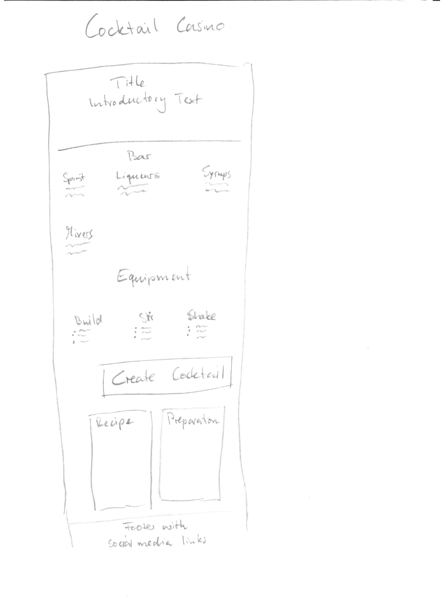
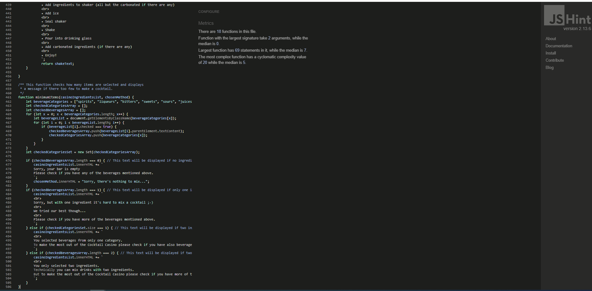
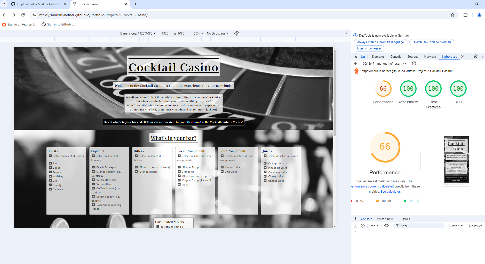

# Cocktail Casino

Cocktail Casino is a website where by virtue of randomization new and unexpected cocktails recipes are created all the while taking into account what the user has at his/her disposal.
It is meant for people who want to break away from the popular cocktails and recipe books and go on a bit more adventurous cocktail journey.

In researching for this idea other websites with similar functionality were found. Like these two:

https://www.cocktailbuilder.com/

https://www.makemycocktail.com/#HowToMakeACocktail

However, pages as the one mentioned above usually ask for what the user has at home and then suggests a cocktail from a database of recipes.
A site where the recipes are created by chance was not found and the thought of what cocktails one would get by randomly choosing ingredients was very intriguing.

Because of the randomization of the ingredients some wild combinations are possible which my or my not taste pleasant. That is why the name "Cocktail Casion" was chosen, since you never know in advance if it is gonna be a win, a lose or maybe a jackpot.
Still, even tough the ingredients are randomized some restrictions are built-in. For example a typical range of the alcohol-to-mixer ratio.

Nonetheless these limitations still allow for a variety of drinks that the user will typically not find on a bar menu while every now and then still producing some classics by chance.

## Table of Contents

- User Stories
- Features
- Future Features
- Typography and Colour Schemes
- Wireframes
- Technology
- Testing
- Deployment
- Credits

## User Stories

### First Time Visitor Goals
- As a first time visitor of this site I immediately want to see what this site is about and see how it works.

### Returning and Frequent Visitor Goals
- As a returning or frequent visitor of the site I want get straight to the business of having fun while experimenting with new cocktail creations.

## Features
- Hompage

  - The homepage is the only page of the website.
  - It is roughly devided into three section: header, main and footer.

  Header

    

    - The header section displays the title of the page, a subtitle as well as an introductory text that is meant to hook the user to stay and play around.
    - It also shows how the site works and what the next step for user is supposed to be.

  Main

    - In the main section the user will find three different areas: the bar area, the equipment area and the area where the new cocktail will be created.

      Bar Area

      

      - The bar area offers the user different lists of ingredients grouped in different categories. By checking/unchecking the corresponding checkboxes the user can specify which of the ingredients are at hand.

      Equipment Area

      

      - The equipment area behaves like the bar area but this time showing the different preparation methods and the required utensils.

      Create Cocktail Area

      

      - In the 'Create Cocktail' area the user will find a button that says "Create Cocktail" and two text fields below it. By clicking on the button the site will generate a recipe and displays in the text field and a randomly selected preparation method in the other text field. Below the user will also find a warning text about the dangers of alcohol consumption that was taken from the Alcohol and Tobacco Tax and Trade Bureau (TTB). (See also Credits below)
      
  Footer

    

    - In the footer the user will find links to the site's social media presences (currently leading to their individual homepages) as well as an invitation to share their recipes there.

## Future Features

- Adding items to the various ingredient lists: In case a user cannot find a certain beverage in the list that he/she has at home but would like to mix cocktails with it, it would be nice to have an additional input field to add ingredients.
- Like other websites it would also be nice to have a library of already existing cocktails (Cuba Libres, Gin Tonic, Mai Tai, Old Fashion, etc.). The user would then be able to choose whether he wants to also include these recipes into the randomization process, choose only from that library at random or to disregard the library.
- Thumps up/down (or sth. similar) by which the user can vote a certain recipe up or down that then feeds into a database. Drawing from that database certain combinations would then be given more or less weight when randomizing. The user would then be able to choose if he/she wants to use the weighted randomization or a neutral one.

## Typography and Colour Schemes

### Typography
- The used fonts are Kaisei Decol and Cantarell. Kaisei Decol was choosen since it has somewhat classy look to it which gives the site an elegant feel. For the lists Cantarell was choosen because it works well with Kaisei Decol but is a bit easier to read which is ideal for lists.

### Colour Schemes
- The look of the site was kept in black and white and a shade of grey (#474747) since together with the chosen fonts it further underlines the classy, elegant feel of the site. (It also is small homage to the heydays of cocktail where movies were still in black and white :-) )
- The background images are also in black and white and work well with the fonds and text field. For the header and the footer an image of a roulette wheel was chosen and for the main content an image of cocktail glasses on a bar thus representing the title of the page visually which contributes to the cohesiveness of the site.

## Wireframes

## Technology

- Gitpod was used for writing and editing the code.
- GitHub is used for storing the code.
- Font Awesome was used to provide the icons for all social plattforms.
- favicon.io was used to turn a png-graphic into usable code to paste into the head element in order to get a favicon.
- Google Fonts provides the Kaisei Decol and Cantarell fonts.
- http://ami.responsivedesign.is/ was used to create the image showing how the website looks on different devices.
- https://www.resizepixel.com/ was used to convert coloured pictures to black and white.
- https://convertio.co/de/download/deb57f2c33700ff0e4cb46b618916815db79dc/ was used for converting jpg to webp.

## Testing

### Code Validation

The W3C Markup Validator and W3C CSS Validator Services were used to check the code of all HTML, CSS and JavaScript files. No errors were found.

Results:

- index.html
  https://validator.w3.org/nu/?doc=https%3A%2F%2Fmarkus-hefner.github.io%2FPortfolio-Project-2-Cocktail-Casino%2F

- CSS
  https://jigsaw.w3.org/css-validator/validator?uri=https%3A%2F%2Fmarkus-hefner.github.io%2FPortfolio-Project-2-Cocktail-Casino%2F&profile=css3svg&usermedium=all&warning=1&vextwarning=&lang=de

- JavaScript
  

### External Links
- All external links open in a new tab.

### Assessibility

- Lighthouse report for mobile:
  

- Lighthouse report for desktop:
  

### User Stories - Test Cases

- As a first time visitor of this site I immediately want to see what this site is about and see how it works.
  - Due to the short introductory text and the one line explanation this is achieved in less than a minute.

- As a returning or frequent visitor of the site I want get straight to the business of having fun while experimenting with new cocktail creations.
  - Due to the clear, unambiguous and compact layout on just one page the returning or frequent visitor can immediately select what he/she has available and start creating new cocktails.

### Feature Testing
| Feature             | User Action | Outcome | Test Result |
| :------------------ | :---------: | :------ | :---------: |
| select/unselect all [...] buttons | click | selects/unselects all checkboxes of corresponding items | passed |
| checkboxes for individual items | click | selects/unselects corresponding item | passed |
| 'Create Cocktail'-button with no ingredient selected (whether or not a preparation method is selected) | click | clears previous text from 'Ingredients'- and 'Preparation Method'-field and displays no recipe and no preparation method but intended messages (see comment in minimumItems function in script.js file) | passed |
| 'Create Cocktail'-button with one or more ingredient(s) and no preparation method selected | click | with regard to the 'Preparation Method'-field: clears previous text and displays "Do you have the equiment to make cocktails? (See "Preparation Methods")" | passed |
| 'Create Cocktail'-button with one ingredient selected | click | with regard to the 'Ingredients'-field: clears previous text and displays 'recipe' and intended message (see comment in minimumItems function in script.js file) | passed |
| 'Create Cocktail'-button with two or more ingredients selected from the same category | click | with regard to the 'Ingredients'-field: clears previous text and displays recipe and intended message (see comment in minimumItems function in script.js file) | passed |
| 'Create Cocktail'-button with two ingredients selected from different categories | click | with regard to the 'Ingredients'-field: clears previous text and displays recipe and intended message (see comment in minimumItems function in script.js file) | passed |
| 'Create Cocktail'-button with three or more ingredients selected from at least two different categories | click | with regard to the 'Ingredients'-field: clears previous text and displays recipe (no additional text) | passed |
| Social Media Icons | click | takes user to their respective homepages in a new tab | passed |

### Bugs
- FIXED: When figuring out how to check if the chosen ingredients were from more than one category array items (which represented the different categories) were used to check if ingredients of that category were checked. If so the item would be push into a new array. The length of this new array would then be used to determine how many categories were "active". However, if there were multiple elements from the same category selected the item representing that category would be push into the new array multiple times producing duplicates and thus making the length of the array useless for this usa case. At first it was unclear how to get rid of duplicates. However, it was eventually solved by converting the array into a set which eliminated all duplicates and then checking for the set's size. (See function minimumItems)
- FIXED: Even tough not just the ingredients but also their amounts are randomized they are still supposed to be in a certain range typical for cocktails. But since this range is different for each beverage category it was not possible to state just one limit since it produced cocktails with an enormous amount of alcohol. This was solved by calling an extra function with an if-statement and several follow-up else-if-statements. This function was then passed the category of the ingredient as a parameter which lead to the correct condition and then passed a maximum number representing the maximum amount as a parameter to the getRandomInt function.

- NOT FIXED: Currently there are no known unfixed bugs.

### Supported Screens and Browsers
  - The website was tested with Firefox and Google Chrome.
  - It was viewed stretched from a width of 270px up to a width of 2300px with no layout problems.

## Deployment

### GitHub

- Log into GitHub account.
- Choose from the correct repository on the left-hand side.
- In the navigation bar at top of the screen click on "Settings". (Attention: not the "Settings" in the drop-down menu in upper right-hand corner.)
- Under "Code and automation" click on "Pages".
- From the drop-down menu under "Source" choose "Deploy from a branch"
- From the first drop-down menu under "Branch" choose your main branch (usually it is called "Master Branch" or just "main").
- From the second drop-down menu under "Branch" choose "/ (root)".
- Click "Save".
- In the navigation bar at top of the screen click on "Code".
- On the right-hand sidebar of the "Code"-page find a section called "Deployments" and click on "github-pages".
- You will find a box labelled "Latest deployments" as well as a list of all deployments so far. Open the website by clicking on the link in the "Latest deployments"-box.

## Credits

- All images on the site are free images from pexels.com.
- The png-graphic that was used to create the favicon was created by Freepik: https://www.freepik.com/icon/cocktail_882775#fromView=search&page=1&position=2&uuid=478434de-e623-467c-acdb-e2b1526fd0ef
- The Asterisk wildcard selector and its properties was used from the "Love Running" Walktrough Project.
- The used syntax for the DOMContentLoaded-event and the triggered function was shown to me by my Mentor Rohit Sharma from Code Institute.
- I copy and pasted the function getRandomInt(max) from https://developer.mozilla.org/en-US/docs/Web/JavaScript/Reference/Global_Objects/Math/random (first function in the "Try it"-box).
- The warning text was copy and pasted from: https://www.ttb.gov/regulated-commodities/beverage-alcohol/distilled-spirits/ds-labeling-home/ds-health-warning