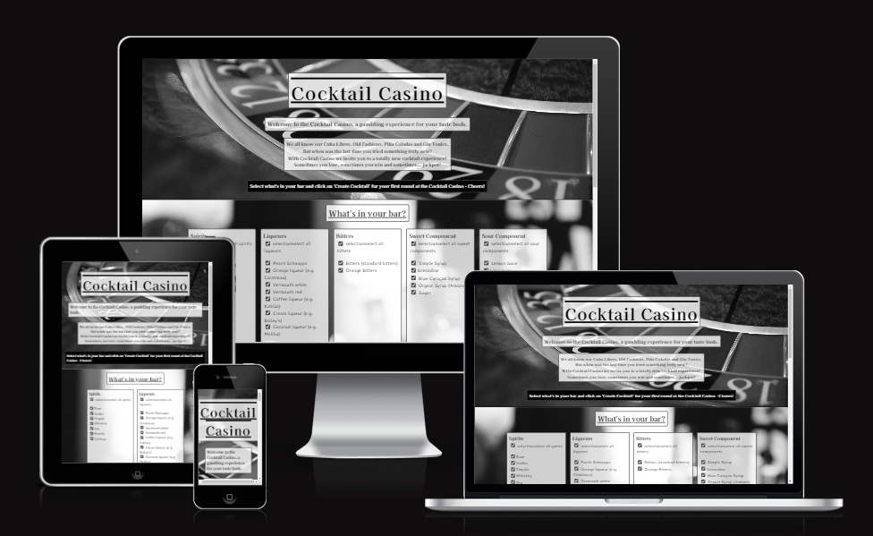
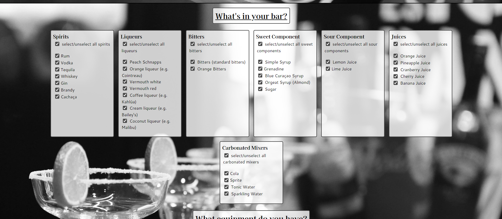

# Cocktail Casino

Cocktail Casino is a website where by virtue of randomization new and unexpected cocktails recipes are created all the while taking into account what the user has at his/her disposal.
It is meant for people who want to break away from the popular cocktails and recipe books and are a bit adventurous in their cocktail journey.

In researching for this idea other websites with similar functionality were found. Like these two:

https://www.cocktailbuilder.com/

https://www.makemycocktail.com/#HowToMakeACocktail

However, pages as the one mentioned above usually ask for what the has at home and then suggests a cocktail from a database of recipes.
A site where the recipes are created by chance was not found.

Because of the randomization of the ingredients some wild combinations are possible which my or my not taste pleasant. That is why the name "Cocktail Casion" was chosen, since you never know it advance if it is gonna be a win, a lose or maybe a jackpot.
Still, even tough the ingredients are randomized some restrictions are build-in. For example a typical range of the alcohol-to-mixer ratio.

Nonetheless this limitations still allow for a variety of drinks that the user will not be able to find on a bar menu while every now and then still producing some classics by chance.

## User Stories

### First Time Visitor Goals
- As a first time visitor of this site I immediately want to see what this site is about and see how it works.

### Returning and Frequent Visitor Goals
- As a returning or frequent visitor of the site I want get straight to the business of having fun while experimenting with new cocktail creations.

## Features
- Hompage

  - The homepage is the only page of the website.
  - It is devided into three section: header, main and footer.

  Header

    

    - The header section displays the title of the page, a subtitle as well as an introductory text that is meant to hook the user to stay and play around.
    - It also shows how the site works and what the next step for user is supposed to be.

  Main

    - In the main section the user will find three different areas: the bar area, the equipment area and the area where the new cocktail will be created.

      Bar Area

      

      - The bar area offers the user different lists of ingredients grouped in different categories. By checking/unchecking the corresponding checkboxes the user can specify which of the ingredients are at hand.

      Equipment Area

      

      - The equipment area behaves like the bar area but this time showing the different preparation methods and the required utensils.

      Create Cocktail Area

      

      - In the 'Create Cocktail'-area the user will find a button that says "Create Cocktail" and two text fields below it. By clicking on the button the site will generate a recipe in the on e text field and randomly selected preparation method in the other text field. Below the user will also find a warning text about the dangers of alcohol consumption that was taken from the Alcohol and Tobacco Tax and Trade Bureau (TTB). (See also Credits below)
      
  Footer

    

    - In the footer the user will find links to the site's social media presences (currently leading to their individual homepages of the plattforms) as well as an invitation to share their recipes there.

## Future Features

- Adding items to the various ingredient lists: In case a user can't find a certain beverage in the list that he/she has at home but would like to mix cocktails with it, it would be nice to have an additional input field to add ingredients.
- Like other websites it would also be nice to have a library of already existing cocktails (Cuba Libres, Gin Tonic, Mai Tai, Old Fashion, etc.). The user would then be able to choose whether he wants to also include these recipes into the randomization process, choose only from that library at random or the leave the library out of the mix.
- Thumps up/down (or sth. similar) by which the user can vote a certain ingredient combination that then feeds into a database and then give certain combinations more or less weight when randomizing. The user would then be able to choose if he/she wants to use the weighted randomization or a neutral one.

## Typography and Colour Schemes

### Typography
- The used fonts are Merriweather and Raleway since they are a bit playful (tiny serifs) to better convey the site's message of being a drum school for kids.
- However, since it is still adults who will visit the site searching for a drum teacher/school for their children the fonts are not carrying it too far with the embellishments.

### Colour Schemes
- The dominant colours are #f5f5f5 (also known as whitesmoke) and a shade of beige/yellow (#fce787). They were chosen because they resemble the colour of a coated drumhead and the wood of a pair of sticks.
- Luckily on the site pexels.com images of a drum kit with a similar beige colour were found which were then used as the title image, as visual dividers for the sections on the homepage as well as on the Confirmation page.
- The hero images at the top and bottom of the homepage and on the Contact Us page were chosen firstly because they show kids playing drums and having a lot of fun doing so. And secondly because the background was white-ish which works nicely with the colour of navigation bar and footer (the already mentioned whitesmoke or #f5f5f5).

## Wireframes

## Technology

- Gitpod was used for writing and editing the code.
- GitHub is used for storing the code.
- Font Awesome was used to provide the icon for all social plattforms.
- favicon.io was used to turn a png-graphic into usable code to paste into the head element in order to get a favicon.
- Google Fonts provides the Merriweather and Raleway fonts which were used an all pages of this site.

## Testing

### Code Validation

The W3C Markup Validator and W3C CSS Validator Services were used to check the code of all HTML and CSS files. No errors were found.

Results:

- index.html
  https://validator.w3.org/nu/?doc=https%3A%2F%2Fmarkus-hefner.github.io%2FPortfolio-Project-1%2F

- contact-us.html
  https://validator.w3.org/nu/?doc=https%3A%2F%2Fmarkus-hefner.github.io%2FPortfolio-Project-1%2Fcontact-us.html

- confirmation.html
  https://validator.w3.org/nu/?doc=https%3A%2F%2Fmarkus-hefner.github.io%2FPortfolio-Project-1%2Fconfimation.html%3Fchilds-first-name%3Dasdf%26childs-last-name%3Dasdf%26childs-age%3D5%26guardians-first-name%3Dasdf%26guardians-last-name%3Dasdf%26email%3Dasdf%2540asdf%26phone%3D

- CSS
  https://jigsaw.w3.org/css-validator/validator?uri=https%3A%2F%2Fmarkus-hefner.github.io%2FPortfolio-Project-1%2Findex.html&profile=css3svg&usermedium=all&warning=1&vextwarning=&lang=de

### Assessibility

- Lighthouse report for mobile:
  

- Lighthouse report for desktop:
  

### User Stories - Test Cases
  - As a visitor of this site I want to find and contact a drum teacher for my 6 year old child who just started elementary school.
    - Because of the simple layout of the site the user will find the Contact Us link right away in the very easily readable navigation bar.
    
    - After clicking on it the user will be re-directed to the site's "contact-us"-form.
    
    - Here the user can fill out the form whereby it won't be send and the user will be notified in case anything is missing but the phone number (which is optional).
    
    - After submitting the form by clicking on the "Count Me In!"-button the user will be re-directed to a confirmation page. From here they can go to homepage, the pricing section, the location section or contact school again via the links in the navigation bar.
    

  - As a parent I want to quickly gather information about this drum school as well as get feel for it in order to find out whether or not it is a possible option for our child.
    - As a first time visitor the user will be greeted with a welcoming and warm homepage. The colour schemes are inviting and coherent and the hero image immediately establishes a feeling that this site is all about drumming and the enjoyment of it. In the navigation bar the user will find links to the different sections and pages.
    
    - To see the section the user can also just scroll down in order to get a better overall impression of the site and thus a better feeling for the school.
    
    - The information is structured a sensible manner. Furthermore at the end of page the user will see another hero image emphasizing again the school's playful approach to playing drums as well as an inspiring quote emphasizing the love for music.
    
    - For further information the user will find in the footer all social links which open in a new tab.

  - As caring guardians we already looked into drum schools and I would like to know what exactly the differences to a more traditional drum schools are. Furthermore I'd like to easily compare pricing and location.
    - Upon entering the homepage the users can quickly and easily find the most relevant information either by clicking on the corresponding links in the navigation bar or by scrolling down. This information is all contained as sections on the homepage for fast accessibility instead of opening a new HTML-file for each.
    
    In the Pricing section the users also learn via a button text that there is a free trial lesson. By clicking on the button the users are directly forwarded to the Contact Us form.
    I
    - Since the title and navigation bar remain at the top of the screen at all times the users are able to move quickly on the site.

### Bugs
- FIXED: At the beginning the background images were implemented as normal images within the HTML file which led to distorted pictures. However, the problem was fixed after the images were loaded as background in the CSS file.
- NOT FIXED: I was unable to get the input field of the form element to get to max-width of 20rem while also being aligned center by the parent container. They are now at their default width which looks a bit odd espacially on larger screen sizes.

### Supported Screens and Browsers
  - The Website was tested with Firefox and Google Chrome.
  - It was viewed stretched from a width of 280px up to a width of 2300px.

## Deployment

### GitHub

- Log into GitHub account.
- Choose from the correct repository on the left-hand side.
- In the navigation bar at top of the screen click on "Settings". (Attention: not the "Settings" in the drop-down menu in upper right-hand corner.)
- Under "Code and automation" click on "Pages".
- From the drop-down menu under "Source" choose "Deploy from a branch"
- From the first drop-down menu under "Branch" choose your main branch (usually it is called "Master Branch" or just "main").
- From the second drop-down menu under "Branch" choose "/ (root)".
- Click "Save".
- In the navigation bar at top of the screen click on "Code".
- On the right-hand sidebar of the "Code"-page find a section called "Deployments" and click on "github-pages".
- You will find a box labelled "Latest deployments" as well as a list of all deployments so far. Open the website by clicking on the link in the "Latest deployments"-box.

## Credits

- All images on the site are free images from pexels.com.
- The png-graphic that was used to create the favicon was from the website clipartmax.com.
- I used the Asterisk wildcard selector, its properties as well as its comment from the "Love Running" Walktrough Project.
- I also used the basic comments from the "Love Running" Walktrough Project to structure my project in the beginning but edited them and added some more as necessary as I progressed.

All other content was written by the developer.